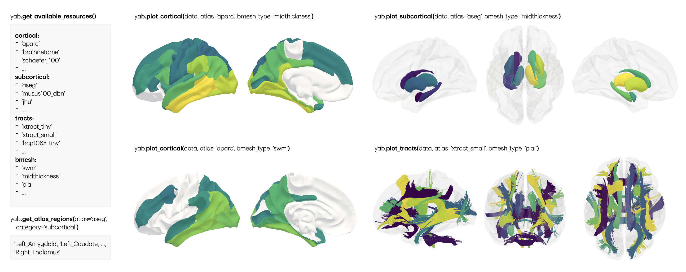

# yabplot: yet another brain plot


[](https://pypi.org/project/yabplot/)
[](https://teanijarv.github.io/yabplot/)
[](https://github.com/teanijarv/yabplot/actions/workflows/tests.yml)
[](https://doi.org/10.5281/zenodo.18237144)

**yabplot** is a Python library for creating beautiful, publication-quality 3D brain visualizations. it supports plotting cortical regions, subcortical structures, and white matter bundles.

the idea is simple. while there are already amazing visualization tools available, they often focus on specific domains—using one tool for white matter tracts and another for cortical surfaces inevitably leads to inconsistent styles. i wanted a unified, simple-to-use tool that enables me (and hopefully others) to perform most brain visualizations in a single place. recognizing that neuroscience evolves daily, i designed **yabplot** to be modular: it supports standard pre-packaged atlases out of the box, but easily accepts any custom parcellation or tractography dataset you might need.

## features

* **pre-existing atlases:** access many commonly used atlases (schaefer2018, brainnetome, aparc, aseg, musus100, xtract, etc) on demand.
* **simple to use:** plug-n-play functions for cortex, subcortex, and tracts with a unified API.
* **custom atlases:** easily use your own parcellations, segmentations (.nii/.gii), or tractograms (.trk).
* **flexible inputs:** accepts data as dictionaries (for partial mapping) or arrays (for strict mapping).

## installation

```bash
uv add yabplot # to install
uv sync --upgrade-package yabplot # to update
```
or
```bash
pip install yabplot # to install
pip install yabplot --upgrade # to update
```

dependencies: python 3.11 with ipywidgets, nibabel, pandas, pooch, pyvista, scikit-image, trame, trame-vtk, trame-vuetify

## quick start

please refer to the [documentation](https://teanijarv.github.io/yabplot/) for more comprehensive guides.

```python
import yabplot as yab
import numpy as np

# check that you have the latest version
print(yab.__version__)

# see available atlases and brain meshes
print(yab.get_available_resources())

# see the region names for a specific atlas
print(yab.get_atlas_regions(atlas='aseg', category='subcortical'))

# cortical surfaces
atlas = 'aparc'
dmap1 = {'L_lateraloccipital': 0.265, 'L_postcentral': 0.086, ...}
dmap2 = {'L_fusiform': 0.218, 'L_supramarginal': 0.119, ...}
yab.plot_cortical(data=dmap1, atlas=atlas, vminmax=[-0.1, 0.3], 
                  bmesh_type='midthickness', views=['left_lateral', 'left_medial'],
                  figsize=(600, 300), cmap='viridis', proc_vertices='sharp')
yab.plot_cortical(data=dmap2, atlas=atlas, vminmax=[-0.1, 0.3], 
                  bmesh_type='swm', views=['left_lateral', 'left_medial'],
                  figsize=(1200, 600), cmap='viridis', proc_vertices='sharp')

# subcortical structures
atlas = 'aseg'
regs = yab.get_atlas_regions(atlas=atlas, category='subcortical')
data = np.arange(1, len(regs)+1)
yab.plot_subcortical(data=data, atlas=atlas, vminmax=[2, 14], 
                     views=['left_lateral', 'superior', 'right_lateral'], 
                     bmesh_alpha=0.1, figsize=(600, 300), cmap='viridis')

# white matter bundles
atlas = 'xtract_tiny'
regs = yab.get_atlas_regions(atlas=atlas, category='tracts')
data = {reg: np.sin(i) for i, reg in enumerate(regs)}
yab.plot_tracts(data=data, atlas=atlas, style='matte',
                views=['left_lateral', 'anterior', 'superior'], bmesh_type='pial',
                bmesh_alpha=0.1, figsize=(1600, 800), cmap='viridis')

```



## acknowledgements

yabplot relies on the extensive work of the neuroimaging community. if you use these atlases in your work, please cite the original authors. if you use this package for any scientific work, please cite the DOI (see more info on [Zenodo](https://doi.org/10.5281/zenodo.18237144)).
